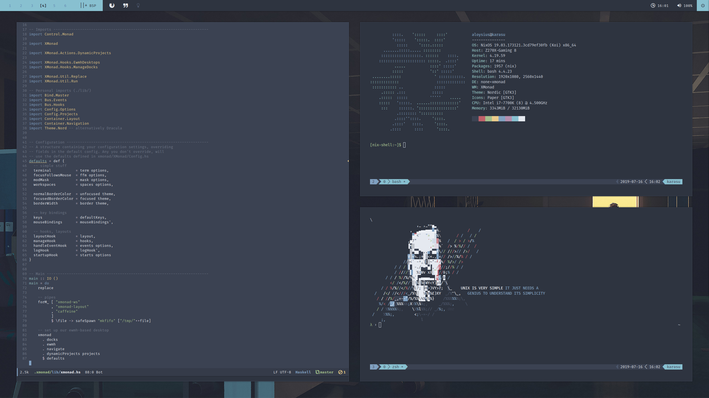
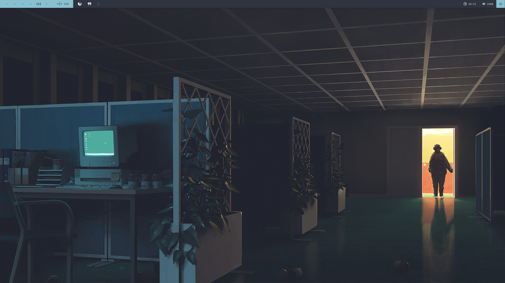

# [Call Me Al](https://www.youtube.com/watch?v=uq-gYOrU8bA)

A [Nord](https://www.nordtheme.com/) themed XMonad configuration.

## Details

TODO

## Latest Preview

## Features

This list contains all of the features not included in the default XMonad experience

| Feature                             | Description                                                                                                         | Access                                  |
| ---                                 | ---                                                                                                                 | ---                                     |
| EWMH                                | Simpler control over X                                                                                              | always on                               |
| Dynamic Projects                    | Each workspace is given as a 'project' with default applications launched on entry if empty                         | always on                               |
| Named Scratchpad                    | Pop over terminal similar to quake/yakuake                                                                          | M-\`                                    |
| Go-to window                        | X.A.WindowBringer - go to windows dmenu prompt for quick jumping between workspaces                                 | M-x g or click on workspaces on polybar |
| Bring window                        | As above, but this time brings a window to your current workspace                                                   | M-x b                                   |
| Search selected                     | Launch a web search for the currently selected text*                                                                | M-/ g/h/w                               |
| Search prompt                       | Launch a dmenu prompt to launch a web search*                                                                       | M-S-/ g/h/w                             |
| Media keys                          | Using media keys via playerctl                                                                                      | always on                               |
| Toggling DPMS                       | Polybar clickable icon to toggle `xset +-dpms`                                                                      | click on lightbulb                      |
| Maximise on single window           | Inspired by the i3-gaps treatment where gaps are disabled for single windows, this applies to all non-float layouts | always on                               |
| Dedicated floating window workspace | A workspace where all windows float (workspace 6 by default)                                                        | M-6                                     |
| Navigation2D                        | Swap windows on workspaces, go to windows and go to screens with keyboard shortcuts                                 | M-/M-S-/M-C- <arrow keys>               |

* g: duckduckgo, h: hoogle, w: wikipedia

## Dependencies

Here are all of the things which this setup needs to work. If you install all of
them you should be able to have the intended experience out of the box. If you
are content editing the configuration files (which you will have to do
eventually) then all of the following should be easily replaceable.

If you notice any missing dependencies please raise an issue so that this table
can be updated.

| Dependency      | Description                                        | Why/Where is it needed?                                                                  |
| ---             | ---                                                | ---                                                                                      |
| `xmonad` v0.15+ | Window manager                                     | self-explanatory                                                                         |
| `dzen2`         | General purpose messaging and notification program | Power menu                                                                               |
| `dmenu2`        | General purpose menu                               | Application launcher, jump to window, bring window                                       |
| `feh`           | Image viewer and wallpaper setter                  | Wallpaper                                                                                |
| `polybar`       | Status bar                                         | Workspace info, layout info, launchers, DPMS toggling, spotify info, time, volume, power |
| `compton`       | Compositor                                         | Shadows and glitz                                                                        |
| `i3lock-fancy`  | Screen locking                                     | self-explanatory                                                                         |
| `dunst`         | Notification daemon                                | self-explanatory                                                                         |
| Fira Sans+Mono  | Fonts                                              | self-explanatory                                                                         |
| FontAwesome     | Icons                                              | self-explanatory                                                                         |
| `nix`           | A purely functional package manager                | Compilation of the xmonad binary                                                         |

For the polybar configuration files please see
[here](https://github.com/nix-overlays). This is managed by home-manager and
contains an overlay for nixpkgs with additional software.

## Default applications

This setup is pretty opinionated. I have some explicit applications named in
`./lib/App/Alias.hs` which you may wish to change to your own preferences.

| Function | Choice    |
| ---      | ---       |
| Terminal | `urxvt`   |
| Browser  | `firefox` |
| Mail     | `geary`   |
| Music    | `spotify` |
| IDE      | `emacs`   |

If you prefer other apps then edit them in this file.

# TODO: finish this doc
